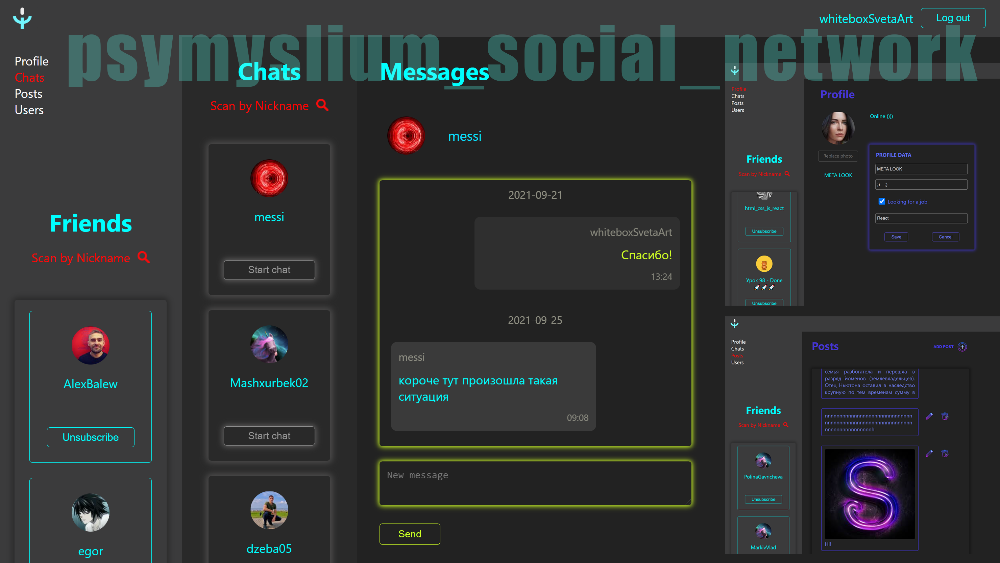
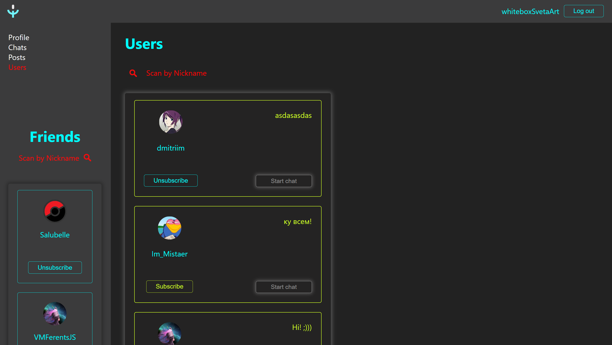
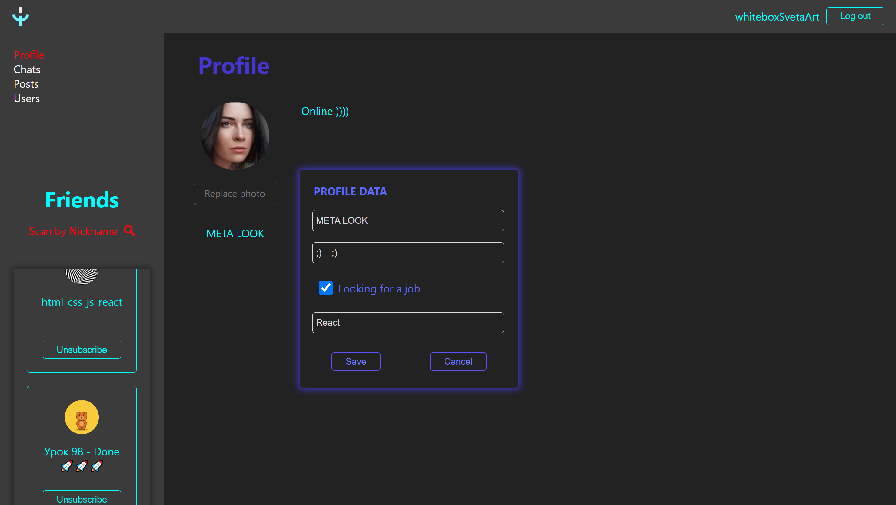
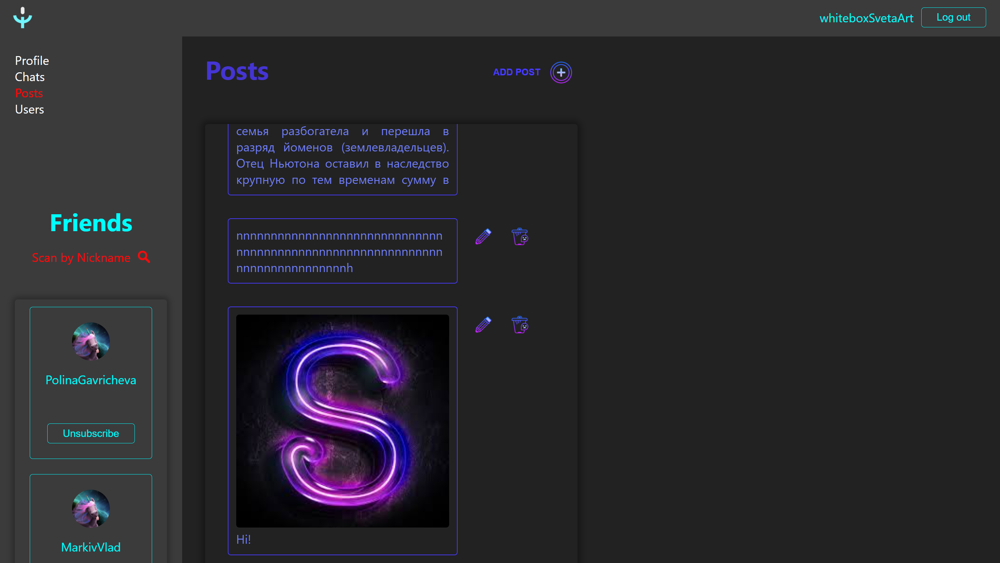
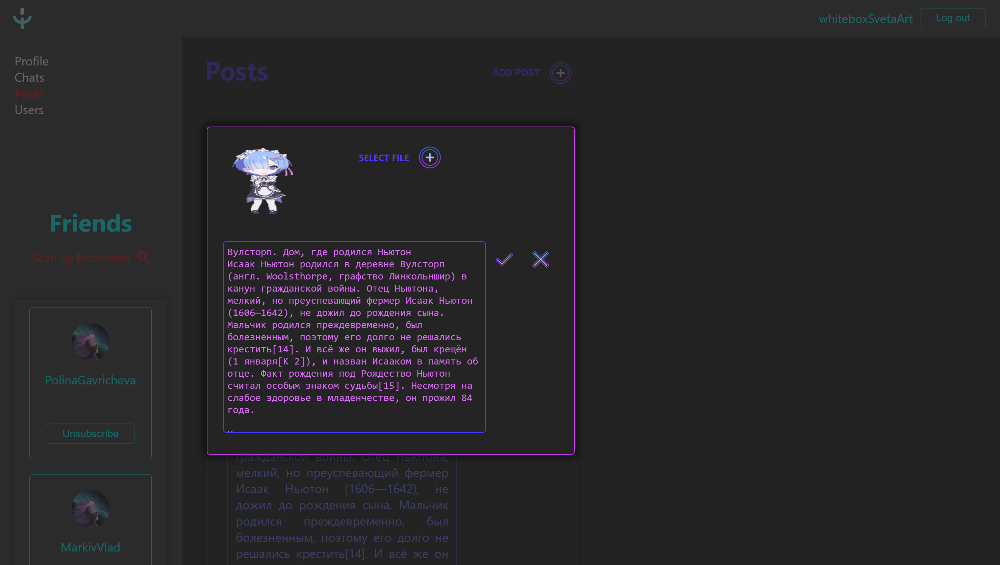
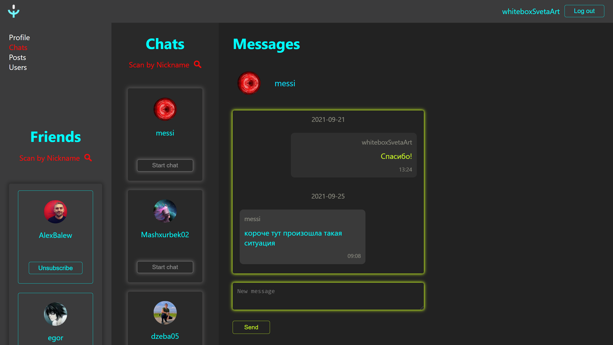
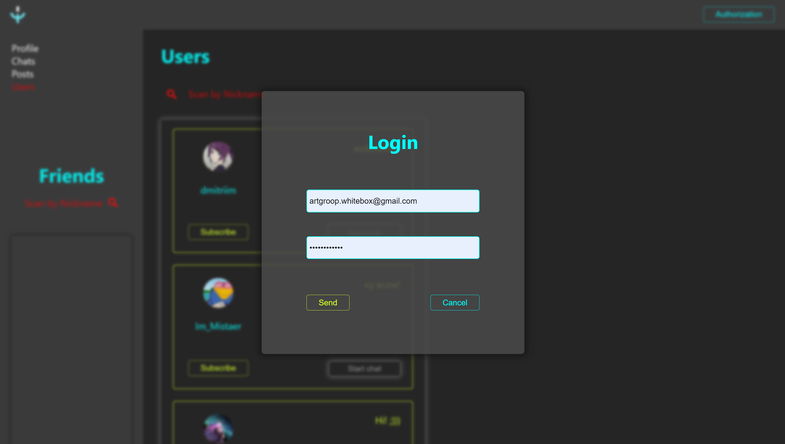

# psymyslium_social_network

to site is published at [https://artgroupwhitebox.github.io/psymyslium_social_network/](https://artgroupwhitebox.github.io/psymyslium_social_network/)

## Description

This is a simple single page application. This is a social network, written as part of a training project - "The Way of the Samurai".

#### Users page and sidebar for friends list:

#### Profile edit page:

#### Posts page:

#### Modal window for editing post:

#### Chats and messades pages:

#### Authorization modal window:

## Technology stack

The project is written in React using the create-react-app packages. Separately used by babel to compile less files.

## Getting Started with Create React App

This project was bootstrapped with [Create React App](https://github.com/facebook/create-react-app).

## Available Scripts

In the project directory, you can run:

### `npm install`
### `npm start`

Runs the app in the development mode.\
Open [http://localhost:3000](http://localhost:3000) to view it in the browser.

The page will reload if you make edits.\
You will also see any lint errors in the console.

### `npm run build`

Builds the app for production to the `build` folder.\
It correctly bundles React in production mode and optimizes the build for the best performance.

### `npm run deploy`

